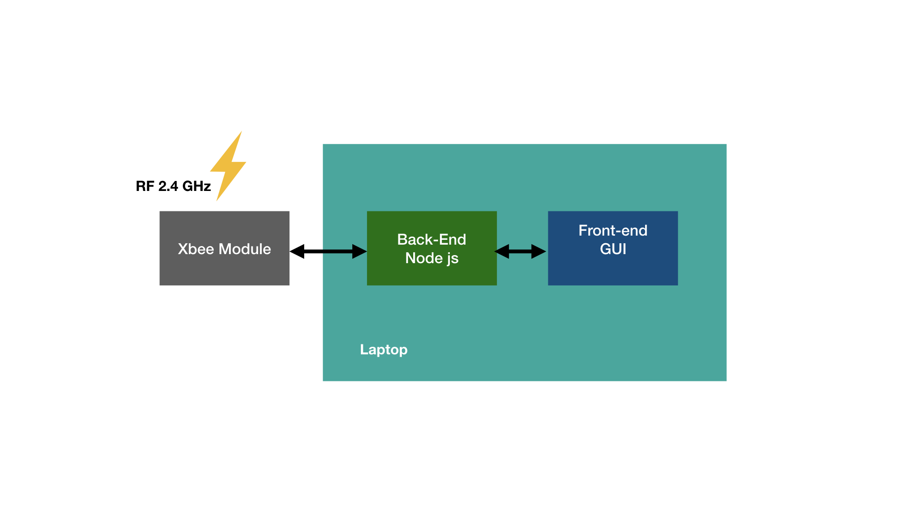

# **GUI-CubeSat-Telemetry**
### Graphical User Interface to display sensor data 
#### The final objective of the web application is to be able to visualize the telemetry obtained from the CubeSat prototype and to be able to send a command so that it starts the data transmission. The designed interface includes two buttons to start and end the transmission, a space to display the received data and graphs to display some data of special importance such as height and voltage.

####The data is obtained by radio frequency through the module, then it is processed by the Back-end and sent to the graphical user interface. when a command is sent from the interface, the information flows to the other side.

